{target=_blank}
## Getting Started with CACAO

[Create an ACCESS account](https://access-ci.org/){target=_blank}

[Requesting an allocation on Jetstream-2](https://docs.jetstream-cloud.org/alloc/overview/){target=_blank}

## Logging into CACAO

Click here: [https://cacao.jetstream-cloud.org/](https://cacao.jetstream-cloud.org/){target=_blank} URL

[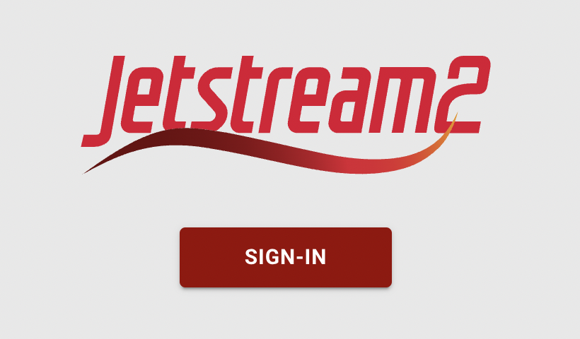](https://cacao.jetstream-cloud.org/){target=_blank}

CACAO uses ACCESS-CI [CILogon](https://www.cilogon.org/) with DuoAuth

[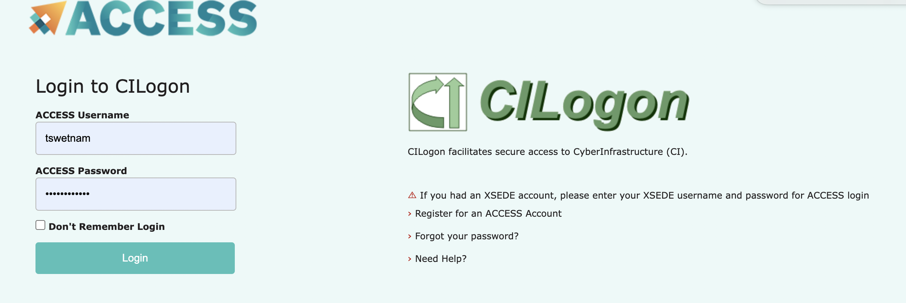](./assets/login.png){target=_blank}

[Setting up DuoAuth Multi-Factor Identity](https://identity.access-ci.org/manage-mfa.html){target=_blank}

[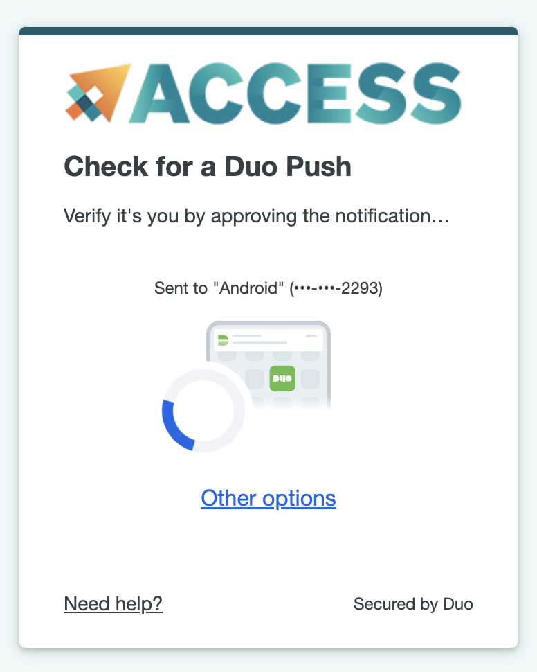](./assets/duo.png){target=_blank}

You should now see the CACAO homepage

[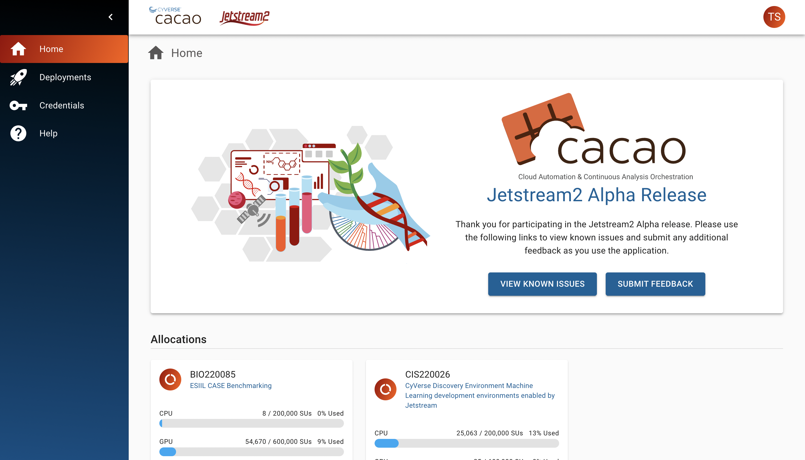](./assets/home.png){target=_blank}

## Creating Credentials

Before you can use Jetstream2 you need to create credentials for your user profile.

[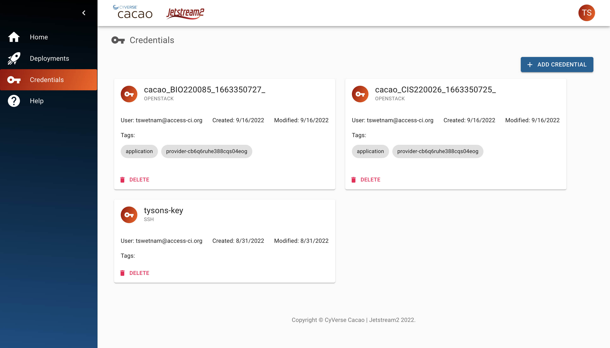](./assets/credentials.png){target=_blank}

Select the **+ Add Credential** button in the upper right of the panel

[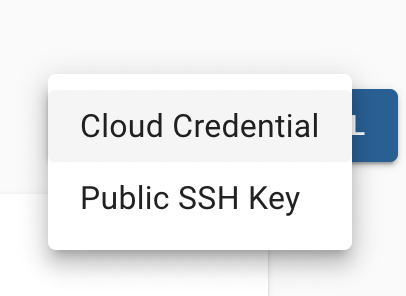](./assets/new_credential.png){target=_blank}

Select the **Cloud Credential** option and select **Jetstream 2**

{target=_blank}

Select any of the Jetstream2 Cloud Projects that you have access to (it may be only one project if this is your first time)

{target=_blank}

You should now see a completed summary with success:

[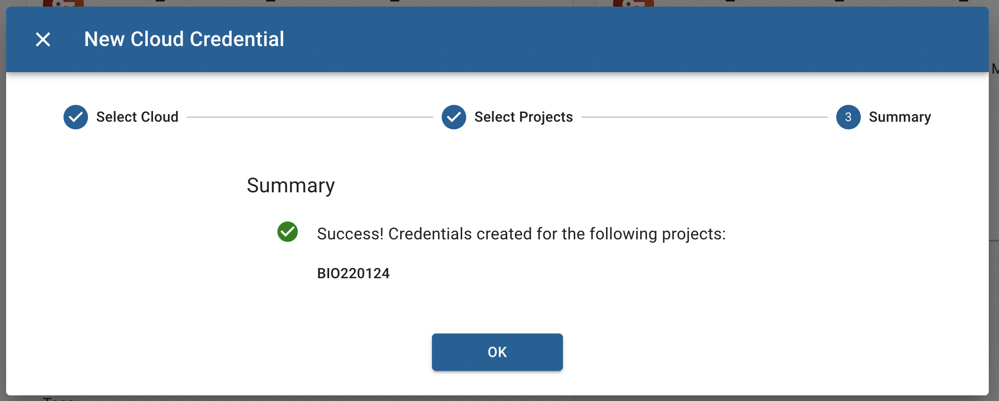](./assets/summary.png){target=_blank}

Optionally, you can also create a Public SSH Key for yourself.

{target=_blank}

SSH keys are a good way to secure your deployments

[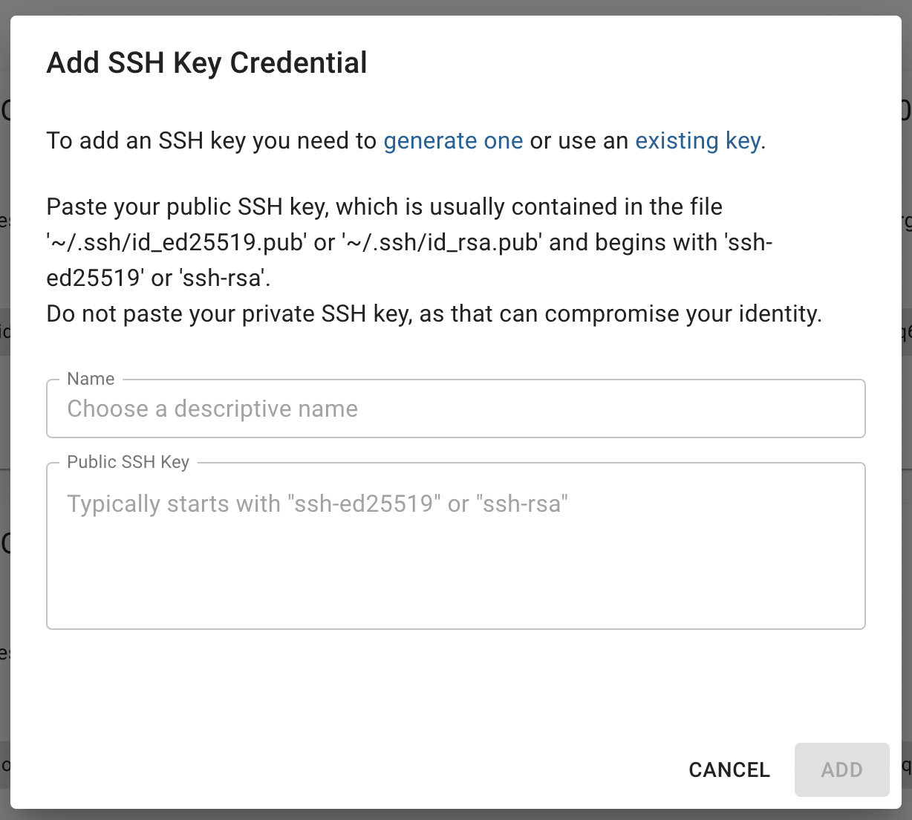](./assets/sshkey.png){target=_blank}

## Create a New Deployment

CACAO uses the concept of Deployments for new projects

Select the Deployments tab on the left side:

[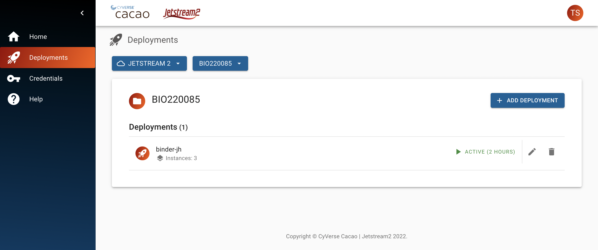](./assets/deployments.png){target=_blank}

Click the **+ Add Deployment** button

Select the **launch a multi-vm zero-to-jupyterhub** template

[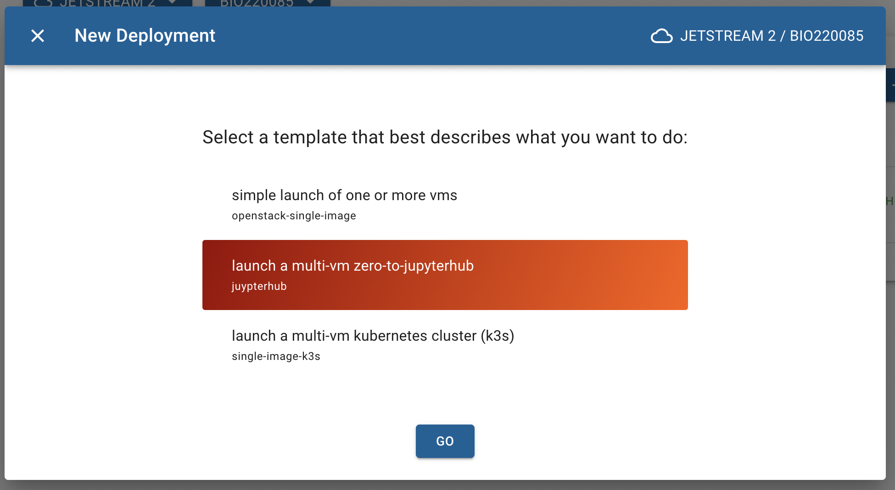](./assets/deployment.png){target=_blank}

## Create a new Jupyter Hub

### Step 1: Set the Region to launch your Jupyter Hub 

??? Info "Currently, CACAO only supports the Jetstream2 IU cloud"

    The only region available to you in Jetstream2 is the Indiana University (IU)

    You may create Credentials in the future with different cloud providers (Commercial or OpenStack) 

[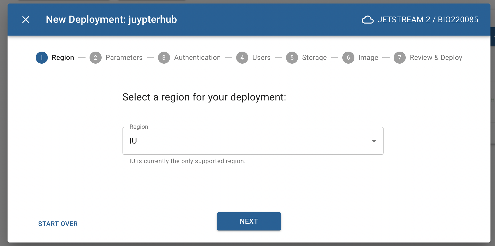](./assets/region.png){target=_blank}

### Step 2: Set the Parameters

Give your deployment a name. This is the name that will show up on the command line, so keep it short and without spaces

[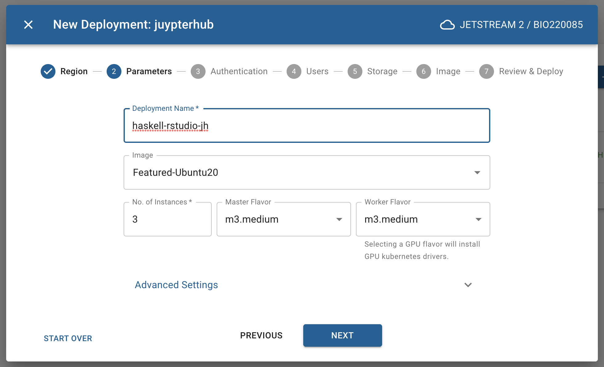](./assets/parameters.png){target=_blank}

Under the advanced options, you can disable access to the master node. Do this if you anticipate a lot of activity across the Hub or by users which max the CPUs and might cause problems managing the cluster.

[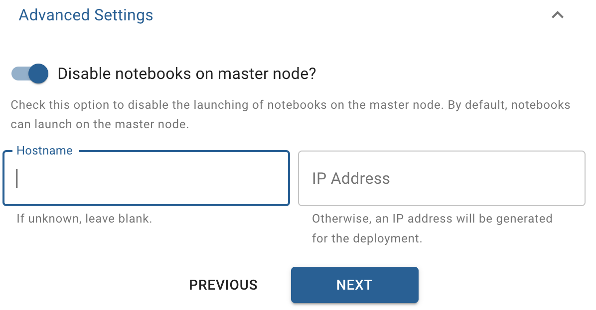](./assets/parameters_advanced.png){target=_blank}

??? Info "Custom Dommain Names"

    You can set up a DNS redirect to your custom website URL. In order to do this, you must set up a permanent IP address which your DNS recognizes.

### Step 3: Set up Authentication

There are two types of user authentication

Dummy Authentication allows you to create new user names and dummy passwords

[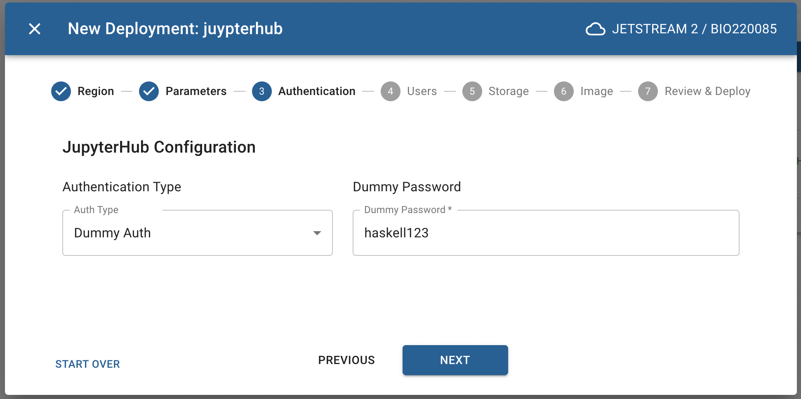](./assets/auth_dummy.png){target=_blank}

GitHub Authentication is a multi-step process

[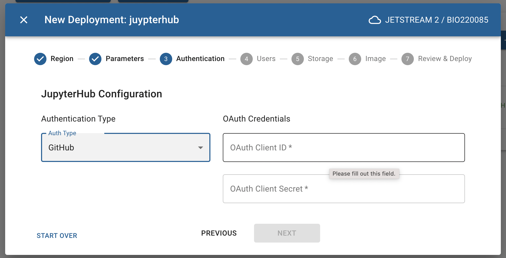](./assets/auth_github.png){target=_blank}

??? Info "Setting up GitHub Authentication"

    TBA

### Step 4: Set up Users

The JupyterHub users can be created at this time.

??? Tip "Important: you must have an administrative user account"

    Make sure to create at least one user with "admin" privileges at this time

    You can create more accounts later on, so if you're in a hurry you only need one admin before launching the Hub.

    More admins and users can be created in the Jupyter Hub Admin panel

[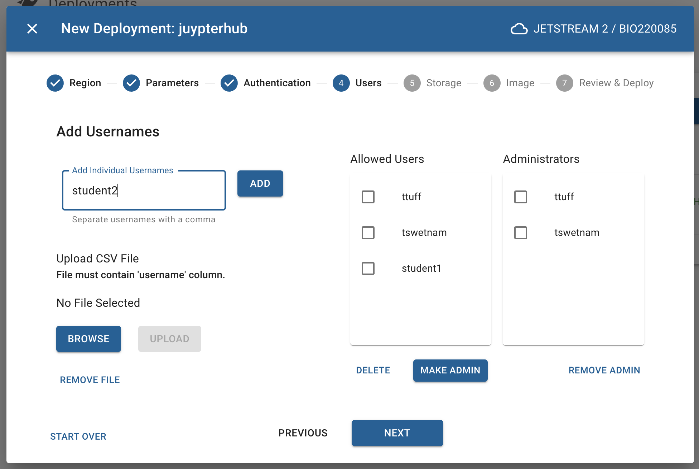](./assets/users.png){target=_blank}

### Step 5: Set up Shared Storage

You can add a Shared Storage volume to your cluster.

You can also choose whether to make this volume "read-only" 

[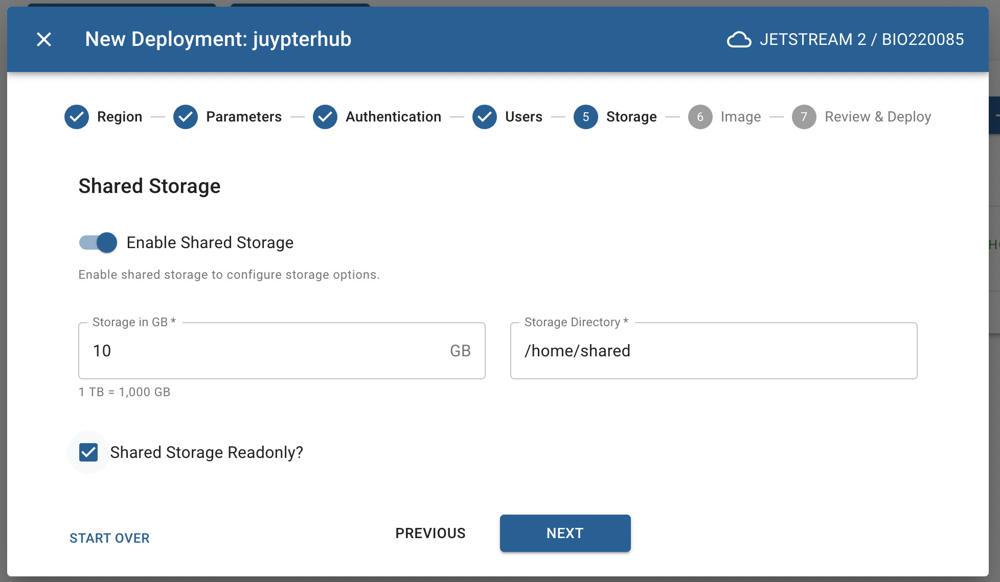](./assets/storage.png){target=_blank}

### Step 6: Select the appropriate Docker Image

In this step you're actually selecting a Docker Image from a public registry

We recommend you use a featured Project Jupyter Docker Stack image, or one of ours:

`harbor.cyverse.org/rstudio/binder:latest`

`harbor.cyverse.org/jupyter/minimal:latest`

`harbor.cyverse.org/jupyter/datascience:latest`

[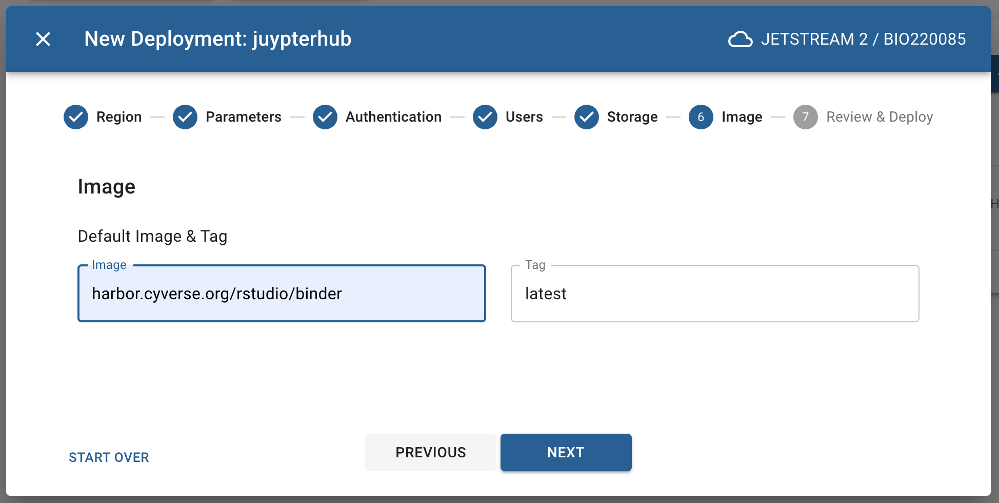](./assets/image.png){target=_blank}

### Step 7: Review and deploy :material-rocket:

You can see all of your choices for the cluster at this time. Make sure they are to your liking then click **Submit**

[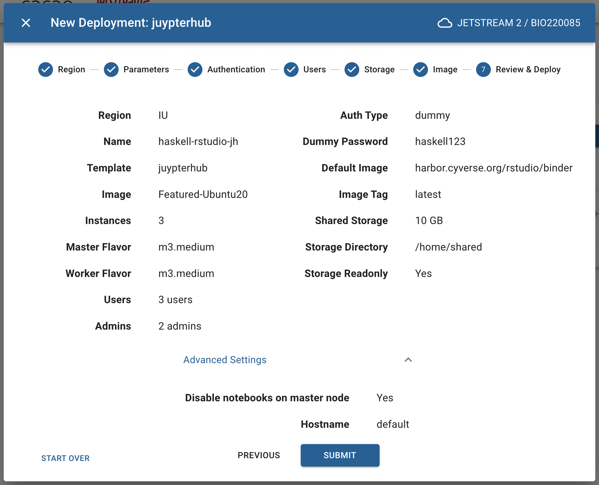](./assets/review.png){target=_blank}

Hubs typically take 8-16 minutes to provision before they are fully "Active"

### Log into JupyterHub for the first time as Admin

Login to the master mode running the Hub by copying the IP address and pasting it in your browser.

[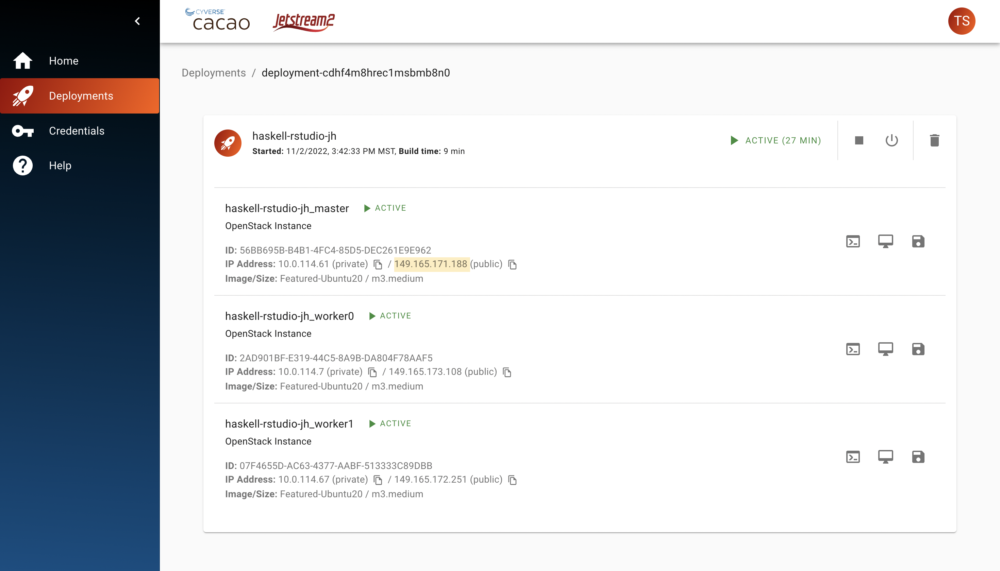](./assets/jupyterhub_master.png){target=_blank}

The Hub will ask for you to login. Enter the `username` and `password` you set up in [Step 3](#step-3-set-up-authentication) and [Step 4](#step-4-set-up-users).

{target=_blank}

The cluster will start up a new instance for your account

[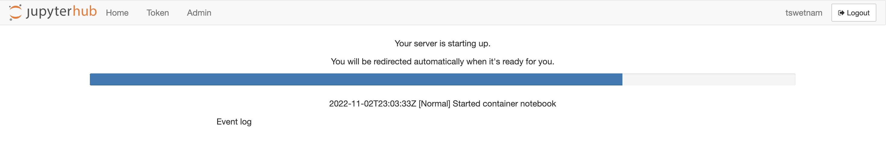](./assets/jupyterhub_startup.png){target=_blank}

You will be taken directly to a JupyterLab instance on the cluster

[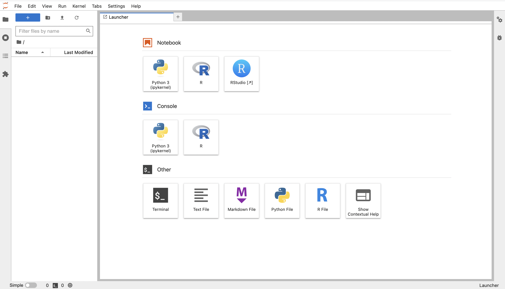](./assets/jupyterlab.png){target=_blank}

To access the Admin Panel, you can enter a different path in the URL: `http://<IPADDRESS>/hub/admin`

[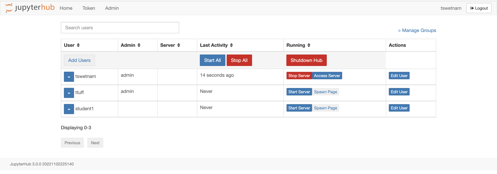](./assets/jupyterhub_admin.png){target=_blank}

As the admin, you can add other admins or user accounts. These will all use the same Dummy Password set up in [Step 3](#step-3-set-up-authentication), unless you chose the option for GitHub Authentication. For Github all new usernames must be validated GitHub accounts. Those users must sign in with their GitHub authentication.